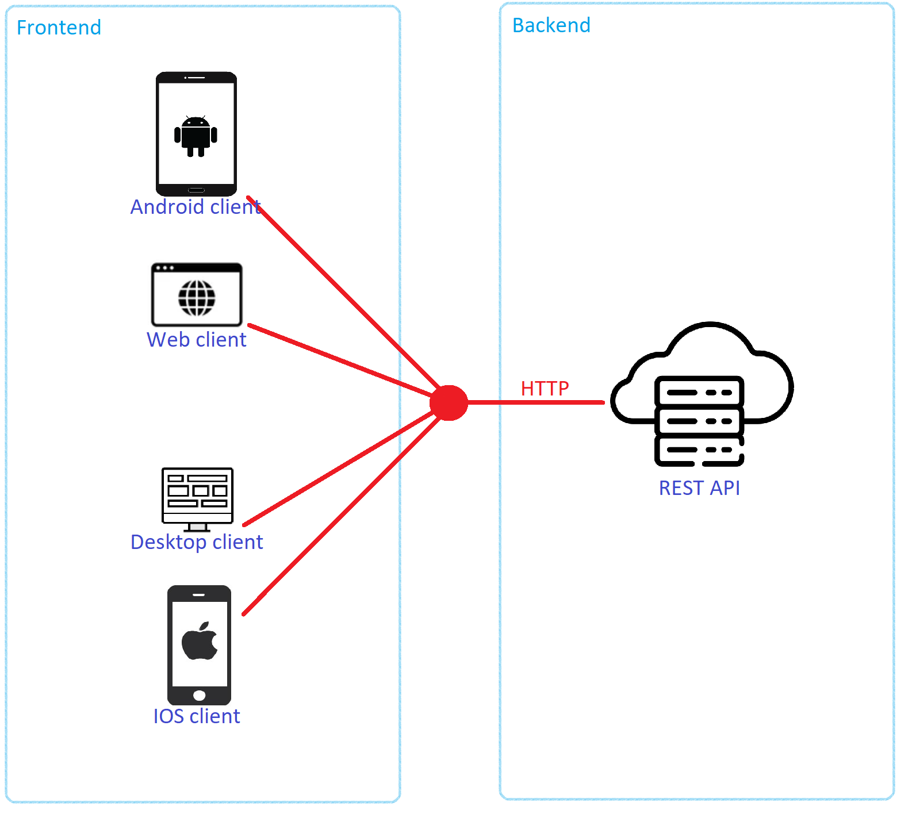

<h1 align="center">Tayckner - Day Tracker & Planner</h1>

  
   
  <i>Tayckner is a multi-platform personal time and productivity manager. You can use it for tracking your activites, plan your day, track your habits, take notes, create tasks, place events on the calendar and more. </i>
   

**Table of contents**

- [Motivation](#motivation)
- [Project status](#project-status)
- [Technologies](#technologies)
- [Development setup](#development-setup)
- [Contributing](#contributing)
- [What have I learned](#what-have-i-learned)

## Motivation

This repository is a part of Tayckner software system which is divided into 5 projects.

This is the repository for the backend application that provides REST API for frontend applications.

Description of the Tayckner as a product itself will be created somewhere in the future and linked here. As for now I'm developing a small part of it for the purpose of "Introduction to mobile applications" course at Warsaw University of Technology. 

This small part contain modules:

- Day tracker
- Day planner
- Habit tracker

About which you can read more [here](docs/planning/text_description.md).

## Project Status

Project development was divided into stages:

**Stage 1 - Planning**

Writing down project requirements, recognizing models, creating ER and UML diagrams, and planning endpoints.

**Stage 2 - REST CRUD**

Implementing planned application to the point where it becomes a CRUD application for all of the models + can register and login users.

**Stage 3 - First Release**

This stage happens in parallel with the development of the android mobile app. During this stage:

- all bugs should be detected and fixed
- probably new endpoints will be added 
- probably existing endpoints will be modified

In other words this stage will adjust backend app to be fully working with the android mobile app.

**Next stages**
- After the mobile app is done Tayckner could be increased with other planned modules.

Application current **stage** is the **3rd** one.

## Technologies

- Java 17
- Gradle
- Spring Boot
  - Spring Data JPA
  - Spring MVC (Tomcat)
- jBCrypt
- MySQL database

## Development setup

See [Development Setup](docs/development_setup.md)

## Contributing

See [Contributing](docs/contributing.md)

## What have I learned?

**Use Swagger IO**

Writing down endpoints documentation manually was very time-consuming.

Solutions such as [Swagger](https://swagger.io) can save tons of time.

**Use Intellij Idea Ultimate**

If You have access to the Ultimate version of Intellij switch to it from Community version as fast as You can.

This is the first project where I am using it, and I'm amazed by this software. Earlier I was totally unaware of that, and now I regret this.

