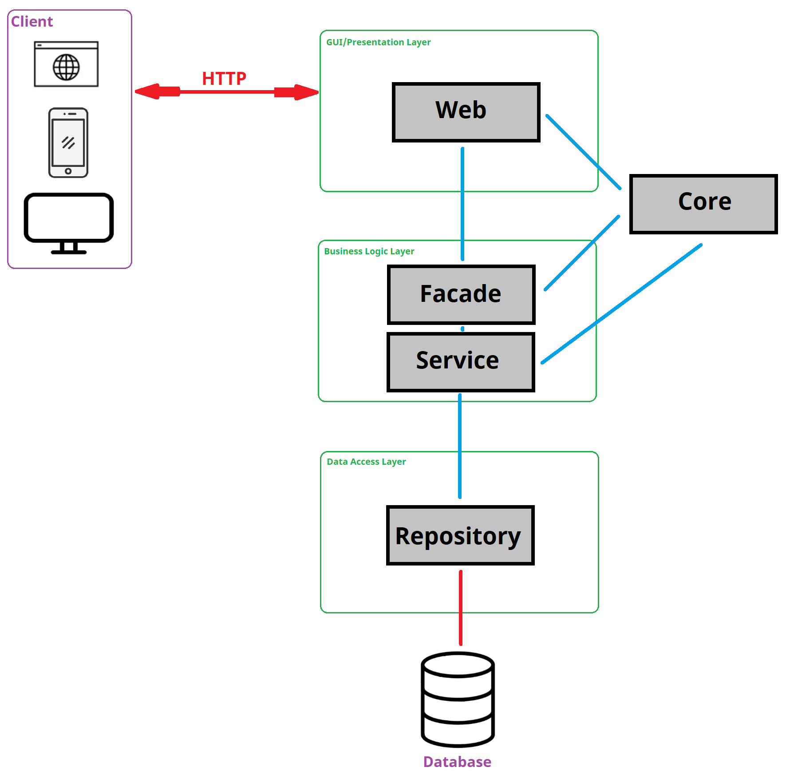

# Application Architecture

>  This file is placed in `docs/planning` directory only for one reason - for better understanding UML class diagram.

The architecture:

- follows layers described in [this article](https://www.juniorjavadeveloper.pl/2020/05/13/aplikacje-java-maja-warstwy-jak-tort-urodzinowy-aplikacja-trojwarstwowa/)
- is strictly linked with used Web Framework which is Spring
- can be called Java Monolith

## Modules

Application is divided into 5 modules. Shown on the image as gray rectangles with black frames and texts.

### Core

The basic assumption about this module is that it contains classes on which other modules depend. Simplifying it is a module with common classes for other modules. If there is a class used in more than one module - it comes here.

The most important thing about this module is that it contains **model (also called "domain")**. Model classes are the objects from reality that we are modelling in our application.
Classes in other modules follow the same pattern in every application (build upon this architecture). But it is the *model* that distinguishes our application from others. And the *model* defines why other modules vary among apps by affecting them.
Model classes follow [POJO pattern](https://en.wikipedia.org/wiki/Plain_old_Java_object).

### Web

This module lays in GUI/Presentation Layers.

It delivers REST API and handles HTTP requests.

### Facade

This module lays in Business Logic Layers.

Every endpoint has its corresponding facade to handle business logic.

### Service

This module lays in Business Logic Layers.

Facades uses these classes to persist data.

They provide mapping between model and entity classes.

### Repository

This module lays in Data Access Layer.

It has direct connection with database.

