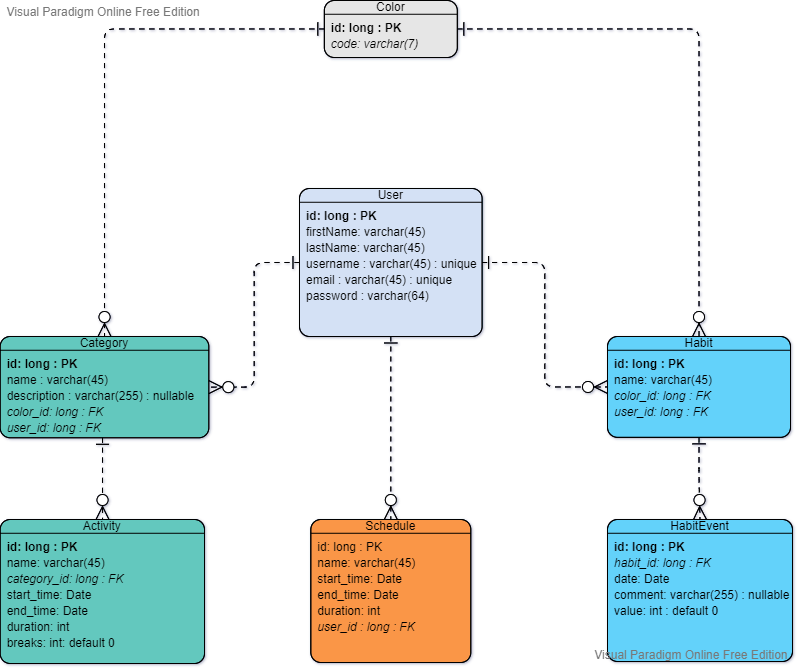

# ER diagram

> ER diagram helps in mapping classes from CRC cards to database relations.

## Link to edit

The used tool is [Visual Paradigm](https://www.visual-paradigm.com/) as I found it the quickest and free for my usage.

[link for edition](https://online.visual-paradigm.com/w/dwzklget/app/diagrams/#diagram:workspace=dwzklget&proj=0&id=1) *hint: eyesto*

## Exported image

